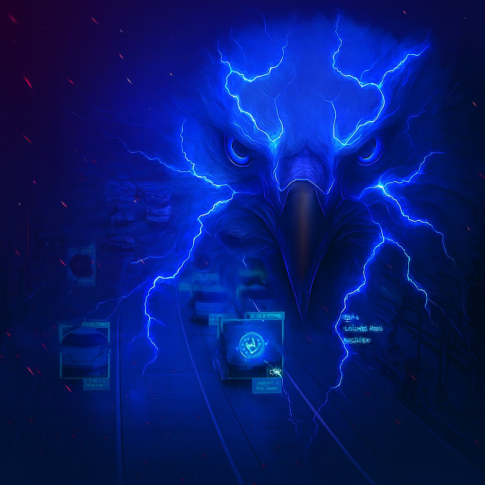

# Eagle OCR — Eagle-Eye



Eagle OCR (Eagle-Eye) is a prototype vehicle plate recognition and lorry revenue/fine management system for county-level traffic enforcement. It combines computer vision (OpenCV), Tesseract OCR, and lightweight local databases (SQLite) with small CLI utilities and a static county dashboard. The project is actively under development — expect breaking changes and incomplete features.

## Project snapshot
- Language(s): Python (FastAPI), Java, C++, HTML/CSS/JavaScript
- Runtime / Frameworks: FastAPI (uvicorn) for the OCR/video processing API; plain static frontend; Java and C++ command-line tools using SQLite.

## What it does
- Process uploaded videos and attempt to detect license plate regions using OpenCV contour detection.
- Use Tesseract OCR to read plate text from candidate regions and compute net weight, revenue, and fines per vehicle.
- Store processed records in a local SQLite database.
- Provide example command-line utilities (Java and C++) for manual data entry, reporting and revenue calculations.
- Includes a static frontend (frontend/eagle.html) which is a county portal mockup (not yet integrated with the API).

## Quickstart (development)
Prerequisites: Python 3.8+, system Tesseract OCR installed, and common Python packages (opencv-python, pytesseract, fastapi, uvicorn, numpy).

1. Install system Tesseract (Ubuntu example):
```bash
sudo apt-get update
sudo apt-get install -y tesseract-ocr libtesseract-dev
```
2. Create virtualenv and install Python deps:
```bash
python -m venv .venv
source .venv/bin/activate
pip install fastapi uvicorn opencv-python pytesseract numpy
```
3. Run the FastAPI service:
```bash
python eagleai.py
# or
uvicorn eagleai:app --host 0.0.0.0 --port 5000
```
4. Upload a video to test (multipart/form-data):
```bash
curl -X POST "http://localhost:5000/process" \
  -F "video=@/path/to/sample.mp4" \
  -F "gross=30.0" \
  -F "tare=10.0" \
  -F "vtype=HEAVY"
```

## Important notes (development / FIXME)
- The repository contains a large SQL schema script `eagle.sql` (Postgres-style, ~35 tables) used as a reference schema. The Python app (`eagleai.py`) currently uses a DB file variable set to `eagle.sql` by name which is likely incorrect — you probably want a SQLite database file like `eagle.db`. Check and update DB_FILE in `eagleai.py` before running.
- Tesseract OCR accuracy depends heavily on camera resolution and plate formatting; the current detector is contour-based (not a learned detector) and may miss plates or include false positives.
- The static frontend (frontend/) is a mockup and is not yet wired to the API endpoints. Integration and authentication are TODOs.

## Where to look next
- `eagleai.py` — FastAPI service, CV plate detector, OCR preprocessing, record storage.
- `frontend/` — static web UI (eagle.html, eagle.js, eagle.css) and assets.
- `eagle.java`, `eagle.c++` — example command-line programs for manual workflows and revenue calculations.
- `eagle.sql` — full reference schema for a more complete production deployment.

## Status
ACTIVE DEVELOPMENT — experimental prototype. Contributions, bug reports, and feature requests are welcome.

## Contributing
If you'd like to help:
- Open issues describing bugs or features.
- Send pull requests with focused changes and tests where applicable.
- For changes to the OCR/detection pipeline, include sample images and expected outputs.

